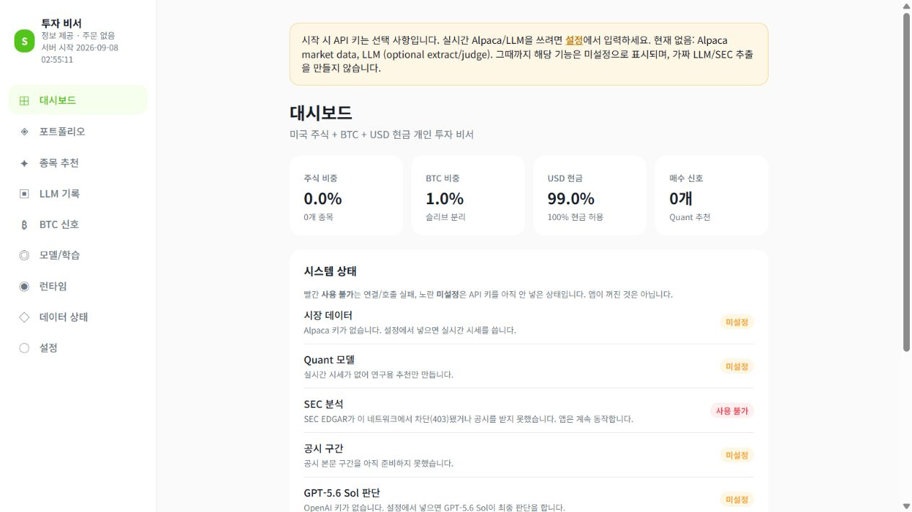
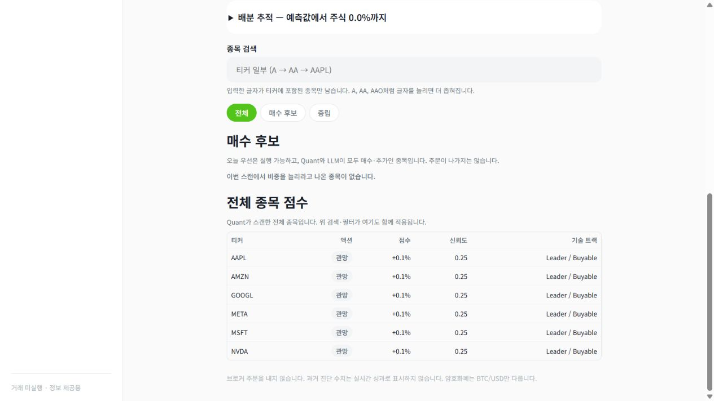
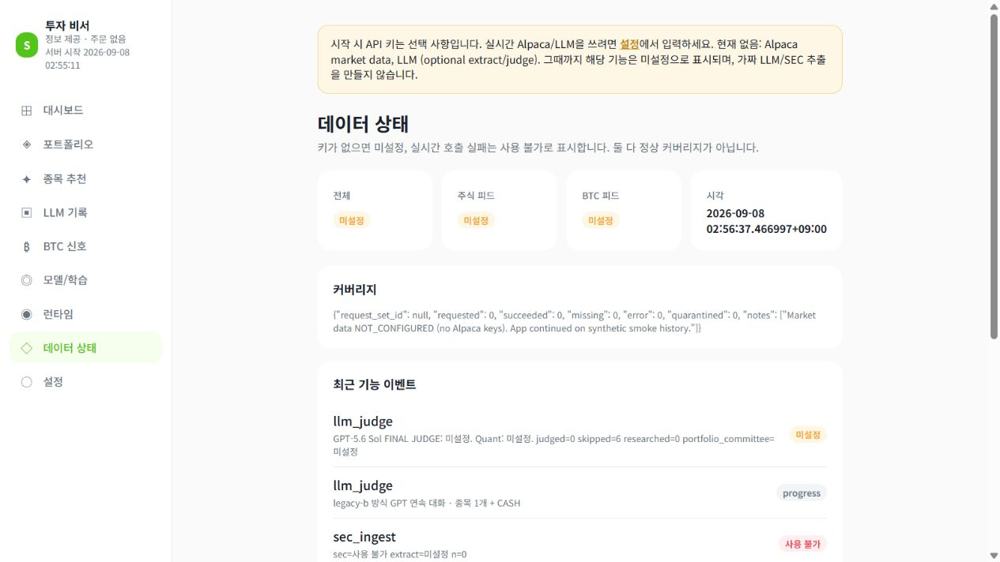
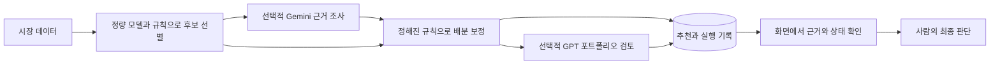

*본래 저만 사용하고자 만든 프로그램이었기 때문에, 추후에 LLM을 활용해 README를 구체화하였습니다.
# AI Investment Research Assistant

개인 투자 과정에서 반복하던 **종목 탐색 → 기업·뉴스 조사 → 포트폴리오 검토**를 하나의 흐름으로 정리한 로컬 투자 리서치 도구입니다. 정량 모델로 후보를 먼저 좁히고, 선택적으로 Gemini의 근거 조사와 GPT의 서술형 검토를 연결합니다.

**미국 주식·BTC·USD 현금을 다루는 의사결정 지원 도구이며, 증권사 주문을 제출하거나 보유 내역을 자동 변경하지 않습니다.**

### 실제 실행 화면

아래는 API 키 없이 합성 시세로 실행한 실제 기본 UI입니다. 예시 비중·가격·진단 수치는 투자 성과가 아니며, LLM 미설정 상태도 그대로 표시합니다.



| 후보와 판단 정보 확인 | 데이터 상태 확인 |
| --- | --- |
|  |  |
| 종목 점수와 조건 미달 시 현금 유지 확인 | 수집 상태·시각과 부족한 입력 확인 |

[키 없이 실행하기](#실행하기) · [설계와 코드 안내](docs/ARCHITECTURE.md) · [검증 기록](docs/VALIDATION.md) · [현재 한계](docs/LIMITATIONS.md)

## 왜 만들었나

개인 투자에서 후보 종목을 찾은 뒤 기업·산업을 조사하고 최근 뉴스와 보유 상황을 다시 확인하는 일을 반복했습니다. 조사 내용이 흩어지면 같은 일을 되풀이하고, 어떤 정보와 기준으로 판단했는지도 돌아보기 어려웠습니다.

이 과정을 **후보 선별, 근거 조사, 최종 검토, 기록 확인**으로 나눴습니다. 목표는 좋은 종목을 AI에게 바로 묻는 것이 아니라, 사람이 판단하기 전에 확인할 정보를 일관된 순서로 모으는 것입니다.

## 어떻게 동작하나



- **정량 경로:** 가격·거래량 등으로 특성을 만들고, 주식은 거래 세션·BTC는 달력 일자 기준의 5/10/20 기간 모델을 적용합니다. 초기 후보 선별과 비중 계산은 코드의 모델·규칙이 담당합니다.
- **근거 조사:** 신규 주식 후보의 공시·기업·뉴스 정보를 Gemini로 정리합니다. 지지·반대 근거와 미확인 사항을 다루며, 유효한 research 점수는 제한된 범위의 비중 보정에 사용될 수 있습니다.
- **최종 검토:** GPT가 후보·근거·포트폴리오 맥락을 받아 서술형 보고서를 만듭니다. 결과와 대화 이력을 로컬에서 확인합니다. 모델 버전은 설정으로 바꿀 수 있습니다.
- **키 없는 실행:** 합성 시세로 정량 경로와 UI를 확인할 수 있습니다. 실제 LLM 응답이나 투자 성과를 만들어 표시하지 않습니다.

## 중요한 설계 결정

| 판단 | 이유와 구현 |
| --- | --- |
| 정량 선별을 먼저 수행 | 모든 종목을 LLM에 보내지 않고 수치 기준으로 조사할 후보를 좁힙니다. LLM 없이도 정량 경로가 동작합니다. |
| 조사와 최종 검토를 분리 | 종목별 근거 정리와 전체 포트폴리오 검토는 필요한 입력과 질문이 다릅니다. 각 단계의 입력·응답을 기록합니다. |
| 오래된 근거의 재사용을 제한 | 일반 research cache에 **45분 TTL**을 적용합니다. 비교 가능한 가격이 있을 때 마지막 종가가 **3% 초과** 변하면 무효화합니다. GPT 재개는 별도 정책입니다. |
| 실패를 상태로 표시 | 외부 요청의 제한 시간·제한 재시도, `DEGRADED`·`STALE`·`UNAVAILABLE`, 유효한 last-known-good 데이터 처리를 둡니다. 실패 시 정상 최신 정보처럼 해석하지 않도록 상태를 확인합니다. |
| 예측 시점과 결과 확정 시점을 구분 | `decision_epoch`로 모델·입력 참조를 연결하고, 만기가 지난 label만 학습·갱신에 사용합니다. 완전한 과거 재현이나 누출 부재를 보증하는 것은 아닙니다. |
| 비용과 주문 권한을 제한 | 자동 Gemini·OpenAI 호출은 UTC 날짜별 기본 **$15 soft budget**을 다음 호출 전에 검사합니다. 실제 결제 상한은 아니며 수동 스캔은 합산에서 제외됩니다. 주문 API는 구현하지 않았습니다. |

**LLM 효과 측정의 현재 범위:** `quant_only`·`llm_final` 출처 구분과 만기 후 outcome 기록 기반이 있습니다. 다만 현재 `quant_only`에는 research 비중 보정이 포함될 수 있고, 주 실행 경로의 GPT 결과는 구조화된 `llm_final` 추천 대신 서술형 보고서로 저장됩니다. 현재 outcome은 종목 가격수익률이며 행동·배분·비용을 반영한 비교가 아닙니다. **LLM 도입으로 투자 성과가 개선됐다고 주장하지 않습니다.** 순수 정량 대조군과 공정한 효과 평가는 [후속 과제](docs/LIMITATIONS.md)입니다.

## 운영과 데이터 경계

- 출처 URL·공시 구간·지지/반대 근거를 검토할 수 있도록 구성합니다. 출처가 있다는 사실이 내용의 정확성을 보증하지는 않습니다.
- 중단된 GPT 검토는 **같은 미국 동부 날짜**의 고정 입력으로 재개합니다. 재개 입력에 45분 TTL을 다시 적용하지는 않습니다. Portfolio signature·market regime 무효화는 검사 함수가 있지만 현재 스캔 경로에는 연결되지 않았습니다.
- 포트폴리오는 실제 계좌 금액 대신 **사용자가 정한 unit**으로 관리합니다. BTC는 이동 제약을 고려하는 별도 자산 영역으로 다룹니다.
- 서버는 `127.0.0.1`에 연결합니다. 키는 Git에서 제외되는 로컬 `.env`에 저장하며 앱 자체 암호화는 없습니다. 외부 LLM을 켜면 조사 대상·입력 근거·포트폴리오 맥락이 해당 제공자에게 전달됩니다.
- 단일 사용자 로컬 도구입니다. 회사 내부 데이터 처리, 다중 사용자 권한 관리, 조직 차원의 승인·감사 체계를 구현한 서비스는 아닙니다.

## 실행하기

Python 3.12와 [uv](https://docs.astral.sh/uv/)가 필요합니다. 저장소를 내려받아 압축을 풀거나 clone한 뒤 **저장소 루트**에서 실행합니다. 기본 UI에는 Node.js가 필요하지 않습니다.

```powershell
uv sync --extra dev --locked
uv run investassist
```

[http://127.0.0.1:8743](http://127.0.0.1:8743)을 열고 **지금 스캔 실행**을 누릅니다. 첫 실행은 필요한 모델을 학습하므로 기다려 주세요. API 키가 없으면 합성 시세를 사용하며, 실제 시장/LLM 기능은 미설정 상태입니다. 기존 `.env`나 환경변수에 키가 설정된 경우에는 live 경로가 사용될 수 있습니다.

| 명령 | 용도 |
| --- | --- |
| `uv run investassist` | 기본 UI와 프로세스 내부 일일 스케줄러 |
| `uv run investassist --init` | 초기화·분석 한 사이클 후 종료 |
| `uv run investassist --live` | UI와 주기적 시세 갱신·스캔 |
| `uv run investassist --help` | CLI 옵션 확인 |

실제 시세·LLM 연동, 스케줄, 데모 재현과 선택적 React client는 [실행 안내](docs/RUNNING.md)를 참고하세요. 기본 화면은 FastAPI/Jinja UI이고 React client는 별도의 간단한 API 조회 화면입니다.

## 검증과 기술 구성

변경 후 다시 실행할 수 있도록 의존성을 고정하고 데이터·시점·장애·예산·주문 경계를 테스트합니다. **2026-09-08 검증에서 Python 427개 테스트, lockfile 검사, Python 패키지 빌드, React clean install/production build를 통과했습니다.** 실행 환경과 알려진 의존성 경고는 [검증 기록](docs/VALIDATION.md)에 적었습니다. 테스트 통과는 실제 투자 성과나 외부 API 품질의 증명이 아닙니다.

| 영역 | 구성 |
| --- | --- |
| 데이터·계산 | Python, DuckDB, pandas/NumPy |
| 정량 모델 | scikit-learn, LightGBM, PyTorch |
| UI·API | FastAPI, Jinja2, Uvicorn / 선택적 React·TypeScript·Vite |
| 외부 연동·검증 | httpx, Gemini/OpenAI API, pytest, uv |

```text
src/trading_system/    데이터, 정량 모델, 조사·검토, 저장, UI
tests/                단위·통합·실패 경로 테스트
docs/                 설계, 실행, 검증, 한계와 실제 화면
ui/                   선택적 React API 조회 client
scripts/              Windows 실행·스케줄 보조 스크립트
```

## 현재 한계와 개발 방식

투자 수익이나 예측 우월성을 보장하지 않습니다. 외부 데이터·LLM의 가용성과 품질에 의존하며, 현재 universe의 과거 사용에 따른 생존편향, 일부 소표본 진단의 한계, GPT 재개 시 근거 재검증과 효과 평가 보완 과제가 있습니다. [구현된 것과 남은 과제](docs/LIMITATIONS.md)를 구분해 기록했습니다.

개발 과정에서 AI coding tools를 구현·리뷰·테스트 보조에 활용했습니다. 문제 정의, 요구사항, 주문 실행을 배제한 시스템 경계와 검증 기준은 프로젝트의 목적에 맞춰 직접 정하고 관리했습니다.
