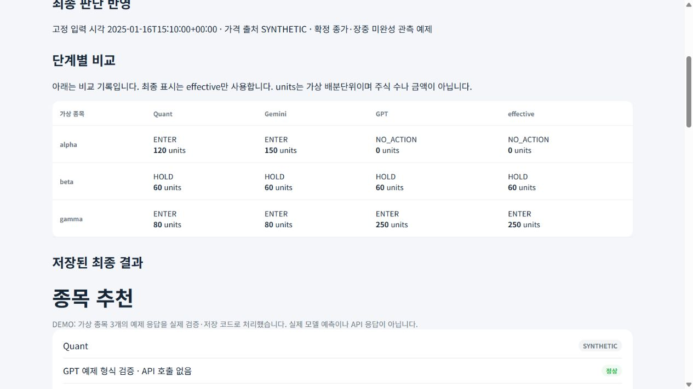
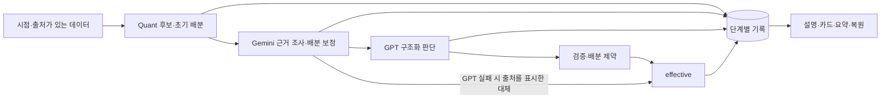

# AI Investment Research Assistant

**수동 투자 리서치를 API로 연결하고, AI 판단의 근거·변경·실패를 추적하는 개인 프로젝트입니다.**

처음에는 별도 프로젝트인 `etf-radar`로 후보를 선별하고 GPT에 직접 조사를 요청했습니다. 반복적인 입력과 결과 정리가 부담스러워 API 기반 시스템을 새로 만들었습니다. 이 저장소는 그 시스템에서 개인 운영 자료를 제외하고, 핵심 판단 흐름을 재현할 수 있도록 공개한 버전입니다.

현재는 이 과정에서 얻은 자동화·검증 경험을 바탕으로 기존 `etf-radar`도 보강했습니다. 그 [최신 코드와 키 없는 검증 데모](https://github.com/petruslihm/etf-radar)를 별도 저장소에 공개했습니다. 이 저장소에서 개발 경위를 먼저 읽고, 관심 있는 구현을 확인할 수 있습니다.

| 먼저 볼 내용 | 확인할 수 있는 것 |
|---|---|
| [개발 경위와 역할](docs/DEVELOPMENT.md) | 실제 불편 → API 도입 → 기존 로직에 자동화·검증 보강 |
| [문제 해결 사례](docs/CASE_STUDIES.md) | 판단과 화면의 불일치, 불완전한 계좌, 최종 단계의 판단 변경, 평가 지표 수정 |
| [평가 결과와 근거](docs/EVALUATION.md) | 공개 재현 범위와 비공개 운영 관찰의 구분, 아직 검증하지 못한 것 |
| [보강한 ETF Radar 소스·데모](https://github.com/petruslihm/etf-radar) | 계좌 입력 누락, 최종 결과 검사, 중단 후 중복 요청 방지 |

## API 키 없이 실행하기

Python 3.12와 [uv](https://docs.astral.sh/uv/)가 필요합니다. 저장소를 내려받은 뒤 루트에서 실행합니다. Node.js와 API 키는 필요하지 않습니다.

```powershell
uv sync --extra dev --locked
uv run investassist --demo
```

[http://127.0.0.1:8744](http://127.0.0.1:8744)를 엽니다. 옵션 없는 `uv run investassist`도 같은 데모입니다. 종료는 Ctrl+C입니다. [상세 실행 안내](docs/RUNNING.md)

**DEMO / SYNTHETIC:** 종목·가격·Quant/Gemini/GPT 출력은 합성 예제입니다. 외부 API를 호출하거나 모델을 학습하지 않습니다. 실제 코드로 판단 검증, 배분 제약, DuckDB 저장, 화면 복원을 실행합니다. 데모 결과는 투자 추천이나 수익률 증거가 아닙니다.



ALPHA는 WATCH로 변경되고, GAMMA의 요청 400 units는 종목 한도에 따라 250으로 조정됩니다. 화면의 GPT 반영 열에는 제약을 적용한 값이 표시됩니다. Units는 사용자 정의 배분단위이며 주식 수나 달러 금액이 아닙니다.

## 구현에서 중점을 둔 것

| 문제 | 현재 구현 | 코드·검증 |
|---|---|---|
| AI 설명과 실제 표시 수치가 달라질 수 있음 | 구조화 결과를 검증하고 제약 적용 후의 `effective`를 설명·카드·요약의 기준으로 사용 | [final_decision.py](src/trading_system/final_decision.py), [데모 테스트](tests/test_submission_demo.py) |
| 호출 실패나 평가 불가를 정상 판단으로 오인 | 실패 대체의 출처를 표시하고, 미확정 값은 `null`로 유지 | [recommendations.py](src/trading_system/recommendations.py), [파이프라인 테스트](tests/test_v1_pipeline.py) |
| 최신 시세와 확정 일봉이 섞임 | 완료 일봉과 장중 관측을 구분하고 출처·수집 시각을 기록 | [decision_data.py](src/trading_system/market/decision_data.py), [시점 테스트](tests/test_price_provenance.py) |
| 결과만 남으면 판단 변경을 설명하기 어려움 | Quant → Gemini → GPT → effective를 같은 입력 ID와 tick에 저장 | [ticks.py](src/trading_system/storage/ticks.py) |
| 지표·출처 라벨이 검증 수준을 과장 | 모델별 시간순 분리 지표를 계산하고, URL 인용과 사실 검증을 구분 | [평가 무결성 테스트](tests/test_evaluation_integrity.py) |



데모에서 **정상 판단, GPT 실패 대체, 평가 불가 보유, 저장 결과 다시 읽기**를 선택할 수 있습니다. 평가 불가 보유는 미보유 0으로 바꾸지 않습니다. 다시 읽기는 기존 결과의 복원이며 새로운 조사가 아닙니다.

## 검증과 실행 범위

```powershell
uv run --locked pytest -q
uv lock --check
uv build
```

[검증 기록](docs/VALIDATION.md) · [자동 검사](https://github.com/petruslihm/ai-investment-research/actions/workflows/ci.yml) · [구조와 코드 탐색](docs/ARCHITECTURE.md) · [현재 한계](docs/LIMITATIONS.md)

선택적 `uv run investassist --app`은 실제 제공자를 연결할 수 있는 연구 UI입니다. 설정된 API 호출에는 비용이 발생할 수 있습니다. 공개 데모 검증에서는 실제 API를 호출하지 않았으며, 별도 `etf-radar`의 운영 사례를 이 코드의 API 품질 검증으로 사용하지 않습니다.

Python · DuckDB · pandas/NumPy · scikit-learn/LightGBM/PyTorch · FastAPI/Jinja · pytest · uv. 미국 주식·BTC·USD 현금을 다루는 로컬 단일 사용자 도구이며 주문 API는 없습니다. 검증된 초과수익, 완전한 과거 시점 재현, 상용 서비스 운영을 주장하지 않습니다.

개인 리서치의 문제 정의와 개발 방향은 작성자가 정했습니다. 코드 구현·문서화·리뷰·테스트 보조에는 GPT와 AI coding tools를 폭넓게 활용했습니다. [작성자 역할과 AI 활용 범위](docs/DEVELOPMENT.md#작성자-역할과-ai-활용)
