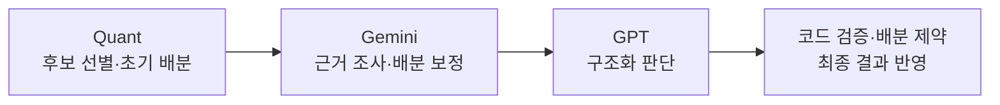

# AI Investment Research Assistant

**먼저 코드로 최근 거래대금 기준 최대 500개 + 관심 종목들의 데이터를 API로 받아와, 이 중에서 기준에 맞는 종목들만 압축하고, LLM API를 통해 압축된 각 종목들의 근거를 찾아 GPT에게 최종 판단 검토까지 요구하는 개인 리서치 도구입니다.**

먼저 처음에는 코드로만 후보 리서치 프로그램을 만들고, 이 데이터들을 정리한 것을 프로그램이 출력해주면, 제가 직접 GPT에게 입력하여 최종적으로 매수/매도할 종목을 추천받는 프로그램을 만들었습니다. 
하지만 프로그램에서 출력해준 후보 종목을 GPT에 반복해서 입력하고 결과를 정리하는 과정에서 불편을 느꼈습니다. 그래서 이 과정을 gpt와 제미나이 API로 연결하고, **AI가 판단을 바꾼 이유와 최종 반영 결과를 함께 확인**할 수 있도록 프로그램을 새로 다시 만들었습니다.


[데모 실행](#데모-실행) · [문제 해결 사례](docs/CASE_STUDIES.md) · [개발 경위와 역할](docs/DEVELOPMENT.md) · [검증 기록](docs/VALIDATION.md)

## 사용 흐름



각 단계의 판단과 화면 결과를 같은 입력 ID로 저장합니다. 사용자는 **어느 단계에서 행동·순위·배분이 바뀌었는지 비교**하고, 저장된 결과를 다시 열어볼 수 있습니다. GPT 실패 시에는 Gemini 반영 결과로 대체하고 그 출처를 표시합니다.


위 화면에서는 ALPHA가 진입에서 관망으로 바뀌고, GAMMA의 요청 배분 400 units가 종목 한도에 따라 250으로 조정됩니다. `effective`는 제약 적용 후 화면에 반영하는 최종 결과입니다.

> **합성 데모 화면입니다.** 종목·가격·AI 출력은 예제이며 실제 모델 응답이 아닙니다. Units는 사용자 정의 배분단위로, 주식 수나 달러 금액을 뜻하지 않습니다.

## 핵심 설계

### 1. AI 설명과 화면 수치를 같은 결과에 연결

AI가 판단을 바꿔도 카드와 요약에 이전 값이 남으면 사용자는 서로 다른 결과를 보게 됩니다. 구조화 응답의 종목·행동·단위·순위를 검사하고, 배분 제약을 적용한 **하나의 최종 결과**를 설명·카드·요약에 공통으로 사용합니다.

### 2. 실패와 모르는 값을 명확하게 표시

GPT 호출 실패나 잘못된 응답은 대체 결과의 출처와 함께 표시합니다. 평가할 수 없는 보유 자산은 **미보유 0으로 바꾸지 않고 미확정 값(`null`)으로 유지**해, 입력 누락을 정상 판단으로 오인하지 않도록 합니다.

### 3. 데이터 출처와 검증 수준을 구분

확정 일봉과 장중 관측을 구분하고 가격의 출처·수집 시각을 기록합니다. 회귀 모델의 지표는 모델별 시간순 분리 평가로 계산하며, 평가 조건이 부족하면 수치를 보류합니다. URL 인용 여부와 원문 사실 검증도 구분해 표시합니다.

[문제 발견 → 수정 → 재현 근거 읽기](docs/CASE_STUDIES.md)

<details>
<summary>구현 코드와 테스트 보기</summary>

| 확인할 내용 | 코드 · 테스트 |
|---|---|
| 판단 검증·배분 제약 | [판단 처리](src/trading_system/final_decision.py) · [데모 테스트](tests/test_submission_demo.py) |
| 실패 처리·미확정 보유 | [추천 데이터](src/trading_system/recommendations.py) · [파이프라인 테스트](tests/test_v1_pipeline.py) |
| 가격 시점·출처 | [가격 데이터](src/trading_system/market/decision_data.py) · [시점 테스트](tests/test_price_provenance.py) |
| 단계별 저장·복원 | [기록 저장](src/trading_system/storage/ticks.py) · [구조 설명](docs/ARCHITECTURE.md) |
| 모델 평가·출처 표시 | [평가 무결성 테스트](tests/test_evaluation_integrity.py) · [평가 범위](docs/EVALUATION.md) |

</details>

## 데모 실행

Python 3.12와 [uv](https://docs.astral.sh/uv/)를 준비한 뒤, 저장소를 내려받아 루트에서 실행합니다. API 키와 Node.js는 필요하지 않습니다.

```powershell
uv sync --extra dev --locked
uv run investassist --demo
```

브라우저에서 [http://127.0.0.1:8744](http://127.0.0.1:8744)를 엽니다. 종료는 `Ctrl+C`입니다.

**정상 판단 · GPT 실패 대체 · 평가 불가 보유 · 저장 결과 다시 읽기**를 선택할 수 있습니다. 외부 API 호출이나 모델 학습 없이 실제 검증·배분 제약·DuckDB 저장·화면 복원 코드를 실행합니다. 다시 읽기는 저장된 결과의 복원입니다.

[상세 실행 안내](docs/RUNNING.md) — 실제 제공자를 연결하는 선택적 연구 UI(`--app`)의 설정과 호출 비용 관련 안내를 포함합니다.

## 검증과 한계

- **확인한 범위:** 합성 입력을 이용한 판단 검증, 배분 제약, 실패 처리, 저장·복원과 패키지 실행. [검증 기록](docs/VALIDATION.md) · [GitHub Actions](https://github.com/petruslihm/ai-investment-research/actions/workflows/ci.yml)
- **아직 검증하지 못한 범위:** 실제 API·모델의 판단 품질, 투자 초과수익, 완전한 과거 시점 재현, 상용 서비스 운영. [평가 계획](docs/EVALUATION.md) · [현재 한계](docs/LIMITATIONS.md)

<details>
<summary>검증 명령 보기</summary>

```powershell
uv run --locked pytest -q
uv lock --check
uv build
```

</details>

## 개발 경위와 역할

기존 [ETF Radar](https://github.com/petruslihm/etf-radar)로 후보를 선별하고 GPT에 직접 조사하던 작업을 자동화하고자 이 시스템을 별도로 개발했습니다. 여기서 얻은 자동화·검증 경험은 ETF Radar를 보강하는 데도 활용했습니다. 두 저장소의 구현과 검증 범위는 각각 구분합니다.

- **작성자:** 개인 리서치의 문제 정의, API 전환 목표 설정, 실제 사용 경험에 따른 개발 방향 선택.
- **AI 도구 활용:** 코드 구현·구조 검토·오류 수정·테스트·문서화에 GPT와 AI coding tools를 폭넓게 활용.

공개본에는 개인 계좌·운영 DB·실제 LLM 응답을 포함하지 않았습니다. [개발 과정과 역할 상세](docs/DEVELOPMENT.md)

**기술 스택:** Python · FastAPI/Jinja · DuckDB · pandas/NumPy · scikit-learn/LightGBM/PyTorch · pytest · uv
