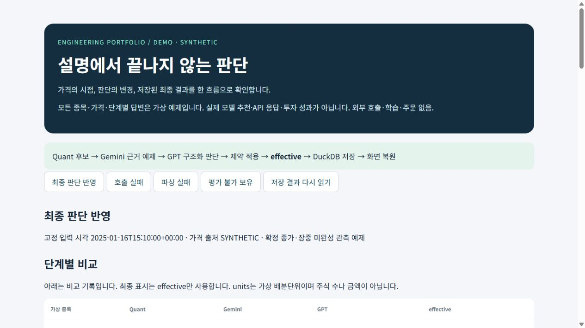
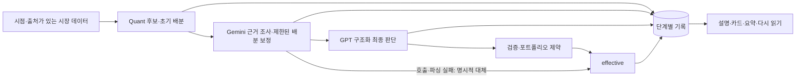

*본래 저만 사용하고자 만든 프로그램이었기 때문에, 추후에 LLM을 활용해 README를 구체화하였습니다.
# AI Investment Research Assistant

**가격의 시점부터 최종 판단·저장·화면까지 추적하는 투자 리서치 포트폴리오.**

후보 선별 뒤 조사 내용과 추천 수치가 서로 떨어져 있으면 어떤 근거로 판단했는지 확인하기 어렵습니다. 이 프로젝트는 Quant → Gemini → GPT → effective를 하나의 기록 흐름으로 연결합니다. 미국 주식·BTC·USD 현금을 다루는 로컬 의사결정 지원 도구이며 주문 API는 없습니다.

## 키 없는 데모

Python 3.12와 [uv](https://docs.astral.sh/uv/)를 설치한 뒤 저장소 루트에서 실행합니다. Node.js와 API 키는 필요하지 않습니다.

```powershell
uv sync --extra dev --locked
uv run investassist --demo
```

[http://127.0.0.1:8744](http://127.0.0.1:8744)를 엽니다. 옵션 없는 `uv run investassist`도 같은 안전한 데모입니다. 종료는 터미널에서 Ctrl+C입니다.

**DEMO / SYNTHETIC:** 가상 종목·가격·단계별 응답을 사용하는 예제입니다. 실제 모델 예측, Gemini/GPT API 응답, 투자 추천이나 성과가 아닙니다. 키가 환경에 있어도 데모는 외부 제공자를 호출하지 않으며 모델을 학습하지 않습니다. 실제 판단 검증·제약 적용·DuckDB 저장·화면 복원 코드를 사용합니다.




## 면접에서 보여줄 세 가지

1. **가격 시점의 명시:** 확정 종가와 장중 미완성 일봉 관측을 구분하고 출처·세션·수집 시각을 표시합니다. 피처와 거래량 비교는 완료 일봉만 사용합니다. 제공되지 않는 체결 시각은 만들어내지 않습니다.
2. **단일 최종 결과:** 구조화 GPT 결과의 종목·행동·단위·순위를 검증하고 포트폴리오 제약을 적용합니다. 설명·카드·정렬·요약은 저장된 `effective`에서 나옵니다.
3. **추적과 복원:** Quant 원본, Gemini 반영, GPT 반영, effective를 같은 입력 ID·기준 시각에 연결해 저장합니다. 실패·미확정 상태와 저장 후 다시 읽은 결과를 회귀 테스트로 확인합니다.

## 판단 흐름



| 단계 | 역할 |
|---|---|
| Quant | 연구 경로에서는 가격·거래량과 5/10/20일 모델 예측으로 후보·초기 배분을 계산합니다. 데모에서는 수작업 예제 값을 사용합니다. |
| Gemini | 신규 주식 후보의 근거·반대 근거·누락을 정리합니다. 유효한 조사 점수는 기존 제한 범위에서 배분을 보정합니다. |
| GPT | 허용된 종목 전체를 다루는 구조화 결과를 검증합니다. WATCH는 기존 보유를 자동 청산하지 않습니다. |
| effective | 제약 적용 후 실제 표시할 결과입니다. GPT 실패 시 Gemini 반영 결과를 대체 표시하며 GPT 최종 판단으로 표시하지 않습니다. |

### 데모에서 확인할 시나리오

- **최종 판단 반영:** ALPHA의 120 → 150 units가 WATCH 0으로 바뀝니다. GAMMA는 최종 순위 1위가 되고 요청 400 units는 종목 한도에 따라 250으로 조정됩니다.
- **호출·파싱 실패:** 최종 GPT 결과 대신 Gemini 예제가 대체 결과로 표시됩니다.
- **평가 불가 보유:** BETA의 보유 존재와 취득단위는 유지하고 현재 평가·목표는 `null`로 남깁니다. 전체 비중·현금은 미확정이며 실행 불가입니다.
- **저장 결과 다시 읽기:** 이전 화면의 동일 입력 ID·결과를 DuckDB에서 복원합니다. 또 다른 판단을 생성하는 기능이 아닙니다.

Units는 사용자 정의 배분단위이며 주식 수·달러 금액이 아닙니다. 실제 미보유 0과 평가 불가 null은 구분합니다.

## 선택적 실제 API 연결

기본 제출 경로는 위 데모입니다. 별도 연구 UI가 필요하면 `.env.example`을 `.env`로 복사하고 원하는 제공자 설정만 입력한 뒤 `uv run investassist --app`을 실행합니다. 연구 UI는 localhost:8743을 사용하며 설정된 제공자 호출에 비용이 발생할 수 있습니다. 이 제출 검증에서는 실행하지 않았습니다.

Alpaca 시장 데이터, SEC 연락처, Gemini·OpenAI 키는 선택 사항입니다. 키가 없으면 연구 UI는 미설정 상태를 표시합니다. 자동 실행에는 UTC 일일 soft budget이 있지만 실제 청구 상한은 아니며 수동 스캔은 이 한도에 합산되지 않습니다. [설정과 실행 안내](docs/RUNNING.md)

## 검증

```powershell
uv run pytest tests/test_submission_demo.py tests/test_openai_judge.py tests/test_v1_pipeline.py -q
uv run pytest tests/test_price_provenance.py -q
uv lock --check
uv build
```

핵심 테스트는 외부 제공자를 대역으로 교체하고 임시 DB를 사용합니다. 데모 테스트는 외부 네트워크 연결을 금지합니다. 전체 검사는 `uv run pytest -q`로 실행할 수 있습니다. [검증 결과와 범위](docs/VALIDATION.md)

## 구조와 한계

Python · DuckDB · pandas/NumPy · scikit-learn/LightGBM/PyTorch · FastAPI/Jinja · pytest · uv. 선택적 React client는 기본 데모에 필요하지 않습니다.

- [구조와 코드 탐색](docs/ARCHITECTURE.md)
- [현재 한계](docs/LIMITATIONS.md)
- [UI 구성](docs/UI_STACK.md)

**수익을 보장하지 않으며 검증된 초과수익 모델이 아닙니다.** 합성 예제와 테스트 통과는 예측 성능의 증거가 아닙니다. 실제 API 응답 품질·모델 가용성은 이번 제출 검증에서 확인하지 않았습니다. 당시 원문·컨센서스·시장 구성과 모델 상태 전체를 복원하는 완전한 과거 재현 시스템도 아닙니다.

개발 과정에서 AI coding tools를 구현·리뷰·테스트 보조에 활용했습니다. 문제 정의, 요구사항, 주문 실행을 배제한 시스템 경계와 검증 기준은 프로젝트의 목적에 맞춰 직접 정하고 관리했습니다.
