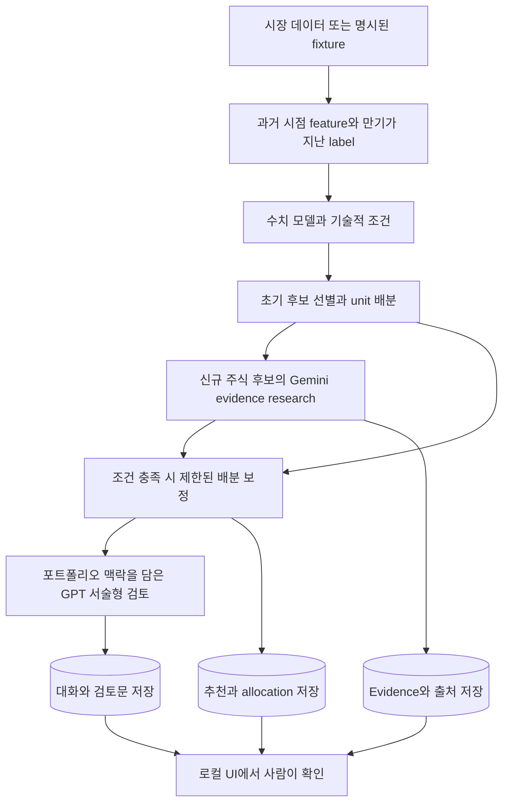

# Workflow와 설계 결정

반복적인 투자 리서치를 **후보 선별 → 근거 조사 → 포트폴리오 검토 → 결과 확인**으로 연결한 단일 사용자용 로컬 애플리케이션입니다. 수치 계산, 비정형 정보 정리, 사람의 최종 판단을 구분합니다. 증권사 주문을 제출하거나 추천에 따라 보유 내역을 변경하지 않습니다.

이 문서는 현재 scan 실행 경로를 설명합니다. 저장형식이나 테스트가 존재하더라도 실행 경로에 연결되지 않은 기능은 별도로 표시했습니다.

## 현재 실행 흐름

LLM 연동이 없어도 초기 수치 계산과 추천 화면은 동작합니다. API key가 없는 fixture 실행은 소프트웨어 흐름을 확인하기 위한 것이며 실제 투자 성과를 나타내지 않습니다. 주식 모델의 label은 SPY 대비 초과수익률, BTC label은 가격수익률로 구분됩니다.

흐름의 중심은 [`run_v1_cycle`](../src/trading_system/v1_cycle.py)입니다. [Feature와 label 생성](../src/trading_system/features.py), [수치 모델](../src/trading_system/ml_engine.py), [배분](../src/trading_system/allocation.py), [research](../src/trading_system/research_agent.py), [GPT 검토](../src/trading_system/openai_judge.py)를 순서대로 연결합니다.

## 역할을 나눈 이유

### 1. 수치로 비교할 수 있는 후보를 먼저 줄입니다

가격·수익률·거래량과 기술적 조건은 수치 모델 및 정해진 규칙으로 처리합니다. 모든 종목에 비싼 정성 리서치를 수행하지 않고 초기 후보를 먼저 정합니다. 같은 입력에 적용되는 배분 규칙과 LLM의 해석을 구분해 확인할 수 있습니다.

현재 구현은 LLM과 수치 배분을 완전히 격리하지는 않습니다. 신규 주식 후보에서 Gemini가 웹 검색을 사용하고 자체 품질 점수가 기준을 충족하면 `research_sizing_multiplier`가 **0.75–1.25** 범위에서 상대적 배분 점수를 보정합니다. 미설정·정보 부족·낮은 품질이면 중립값 1.0을 사용하며 기존 보유 종목과 BTC에는 이 research 보정을 적용하지 않습니다. 이는 LLM의 자가평가 점수에 지나친 영향력을 주지 않기 위한 제한이며, 점수의 정확성을 보장하지는 않습니다.

근거: [배분 규칙](../src/trading_system/allocation.py), [실제 research와 배분 연결 테스트](../tests/test_v1_pipeline.py).

### 2. 근거 조사와 최종 검토를 나눕니다

Gemini는 신규 주식 후보의 기업·산업·뉴스·공시를 조사하고 지지 근거, 반대 근거, 미해결 질문과 출처를 정리합니다. GPT는 후보, 수치 결과, research 요약, 포트폴리오 맥락을 받아 연속 대화로 검토문을 작성합니다. 모델 버전보다 역할과 입력·출력 경계를 중심으로 구성했습니다.

현재 GPT 결과는 **서술형 검토문과 대화로그**입니다. 이를 구조화된 `llm_final` 추천으로 자동 변환하거나 보유 내역에 적용하지 않습니다. Source 표시는 근거를 다시 확인하기 위한 장치이며 원문 내용의 사실 검증을 대신하지 않습니다.

근거: [Research](../src/trading_system/research_agent.py), [GPT 대화](../src/trading_system/openai_judge.py), [출처 표시](../src/trading_system/judge_package.py).

### 3. 추천 시점과 결과가 확정되는 시점을 구분합니다

Feature는 해당 날짜까지의 lookback으로 만들고 label은 예측 기간이 지난 뒤 사용합니다. 주식의 5/10/20 horizon은 거래 세션, BTC는 달력 일자 기준입니다. 학습 데이터는 시간순으로 분리하고, 일반 경로에서 예측 기간만큼 날짜 간격을 두어 학습·평가 기간의 겹침을 줄입니다.

`decision_epoch`는 한 추천에 사용한 모델 참조와 전처리·수식 버전을 연결하는 기록입니다. Feature snapshot과 이후 outcome snapshot도 분리합니다. 다만 일부 hash는 실제 전체 상태를 반영하지 않으며, 극소 표본의 분할 예외와 현재 universe의 과거 적용 문제가 있어 완전한 재현이나 미래정보 누출 부재를 보증하지 않습니다.

근거: [Feature/label](../src/trading_system/features.py), [시간순 분할과 학습](../src/trading_system/ml_engine.py), [epoch 형식](../src/trading_system/models/registry.py).

## 운영 중 확인할 경계

| 관심사 | 현재 연결된 동작 | 설계 이유와 범위 |
| --- | --- | --- |
| Research 최신성 | 일반 cache TTL 45분, 마지막 종가 변화 3% 초과 시 무효화. 종목·공시·action·unit bucket·prompt version도 cache key에 포함 | 오래된 조사 결과의 무조건 재사용을 줄임. 실시간 뉴스 완전성이나 실시간 가격 갱신을 보장하지 않음 |
| 중단된 GPT 검토 | 같은 ET 날짜의 고정 입력과 동일 prompt의 성공한 대화 prefix를 재사용 | 중복 호출 비용을 줄임. 재개 경로는 일반 research TTL과 별개이며 입력 변경을 다시 검사하지 않음 |
| 외부 서비스 장애 | Deadline, 제한 재시도, 명시적인 실패 상태. 시세 조회 실패 시 last-known-good을 STALE/DEGRADED로 기록 가능 | 장애를 최신·정상 정보로 해석하지 않도록 함. 일부 재개·재시작 상태 표시에는 알려진 한계가 있음 |
| 자동 LLM 비용 | Gemini와 OpenAI의 추정 비용을 UTC 날짜별 합산하고 다음 호출 전에 기본 $15 기준을 검사 | 결제 상한이 아닌 soft threshold. 수동 scan은 자동 예산 합산 대상에서 제외 |
| 보유 내역 | 사용자 정의 unit과 lot으로 관리. 추천이 lot을 자동 변경하지 않음 | 실제 계좌 금액을 입력할 필요 없이 판단 맥락을 표현 |
| BTC | 별도 sleeve, 주식과 다른 달력, 유동성·이체 대기 상태 반영 | BTC를 즉시 이동 가능한 주식 cash로 가정하지 않음 |
| 실행 권한 | Market-data 연동만 사용. Broker/order 제출 경로 없음 | 리서치 출력과 실제 거래의 경계를 유지 |

근거: [Freshness](../src/trading_system/evidence_pack.py), [Resume](../src/trading_system/openai_judge.py), [외부 호출](../src/trading_system/providers/never_block.py), [시세와 LKG](../src/trading_system/market/service.py), [예산](../src/trading_system/llm_budget.py), [Portfolio](../src/trading_system/portfolio.py), [BTC](../src/trading_system/btc_sleeve.py).

## 현재 기능과 평가를 위한 기반의 구분

| 항목 | 현재 상태 |
| --- | --- |
| Quant 추천, research, GPT 검토문, 실행 로그 | 주 scan 경로에서 생성·저장. LLM은 credential 및 외부 서비스 가용성에 의존 |
| `quant_only` / `llm_final` source 형식 | 둘 다 존재. 현행 scan은 `quant_only` 추천과 별도 GPT 검토문을 저장하며 `llm_final` 추천을 만들지 않음 |
| 순수 Quant 대조군 | 최초 allocation은 존재하지만 Gemini 배분 보정 전 결과를 독립된 대조군으로 보존하지 않음. 저장명 `quant_only`만으로 무LLM 결과임을 보장할 수 없음 |
| 만기 후 outcome 및 override 비교 | 지원 코드 존재. 행동·배분·비용을 반영한 LLM 도입 효과 검증은 미완성 |
| Portfolio signature / regime cache 무효화 | 함수와 단위 테스트 존재. 현행 research 호출에는 두 입력이 연결되지 않음 |
| 구조화된 GPT 추천의 portfolio gate | 함수와 단위 테스트 존재. 현행 서술형 GPT 경로에는 적용되지 않음 |

평가와 운영에서 이 차이가 갖는 의미는 [현재 한계와 후속 검증 기준](LIMITATIONS.md)에 정리했습니다.

## 코드를 읽는 순서

| 모듈 | 책임 |
| --- | --- |
| [`v1_cycle.py`](../src/trading_system/v1_cycle.py) | 데이터 준비부터 저장·상태 반환까지 한 번의 scan 연결 |
| [`market/`](../src/trading_system/market/) / [`providers/`](../src/trading_system/providers/) | 거래 달력, 시세 수집, 입력 검증, 오류와 LKG 처리 |
| [`features.py`](../src/trading_system/features.py) / [`technical_features_pit.py`](../src/trading_system/technical_features_pit.py) | 날짜별 feature 및 만기가 지난 label 생성 |
| [`ml_engine.py`](../src/trading_system/ml_engine.py) | 모델 학습·추론, 확정 label을 사용하는 갱신, 모델 변경 기록 |
| [`allocation.py`](../src/trading_system/allocation.py) | 수치 기반 후보·unit 배분과 명시적인 research 보정 |
| [`research_agent.py`](../src/trading_system/research_agent.py) / [`evidence_pack.py`](../src/trading_system/evidence_pack.py) | 근거 조사, 반대 관점 검토, cache 및 출처 묶음 |
| [`openai_judge.py`](../src/trading_system/openai_judge.py) / [`llm_budget.py`](../src/trading_system/llm_budget.py) | 서술형 검토, 중단 재개, 자동 호출 비용 검사 |
| [`storage/`](../src/trading_system/storage/) / [`outcomes.py`](../src/trading_system/outcomes.py) | DuckDB 저장, scan 단위 commit, 만기 후 종목 수익률 기록 |
| [`portfolio_service.py`](../src/trading_system/portfolio_service.py) / [`btc_sleeve.py`](../src/trading_system/btc_sleeve.py) | 수동 보유 관리, unit 평가, BTC 상태 |
| [`ui/`](../src/trading_system/ui/) | FastAPI API와 별도 frontend build 없이 실행되는 기본 화면 |

기본 제품 UI는 FastAPI/Jinja입니다. 저장소의 별도 [`ui/`](../ui/)는 선택적 React client입니다. 실행법은 [README](../README.md), 세부 UI 구성은 [UI stack](UI_STACK.md)을 참고하세요.
